# CJD80 - Diagrammes d'Architecture

Collection complète de diagrammes Mermaid pour l'architecture et les flows de l'API CJD80.

Version: 2.0.0 | Date: 22 janvier 2026

---

## Table des Matières

1. [Architecture Globale](#architecture-globale)
2. [Architecture Backend](#architecture-backend)
3. [Flow d'Authentification](#flow-dauthentification)
4. [Flow Requête-Réponse](#flow-requête-réponse)
5. [Modèle de Données](#modèle-de-données)
6. [Flows Métier](#flows-métier)
7. [Infrastructure](#infrastructure)

---

## Architecture Globale

### Vue d'Ensemble du Système

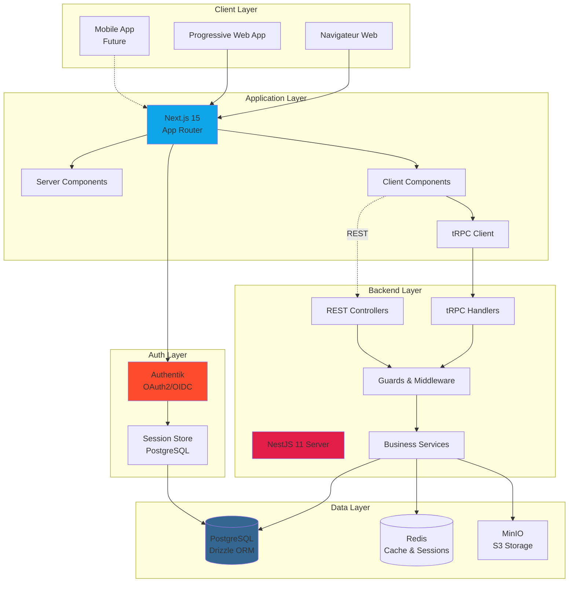
```mermaid
graph TB
    subgraph "Client Layer"
        Browser[Navigateur Web]
        PWA[Progressive Web App]
        Mobile[Mobile App<br/>Future]
    end

    subgraph "Application Layer"
        NextJS[Next.js 15<br/>App Router]
        ServerComponents[Server Components]
        ClientComponents[Client Components]
        tRPCClient[tRPC Client]
    end

    subgraph "Backend Layer"
        NestJS[NestJS 11 Server]
        tRPCServer[tRPC Handlers]
        RESTControllers[REST Controllers]
        Guards[Guards & Middleware]
        Services[Business Services]
    end

    subgraph "Data Layer"
        PostgreSQL[(PostgreSQL<br/>Drizzle ORM)]
        Redis[(Redis<br/>Cache & Sessions)]
        MinIO[MinIO<br/>S3 Storage]
    end

    subgraph "Auth Layer"
        Authentik[Authentik<br/>OAuth2/OIDC]
        SessionStore[Session Store<br/>PostgreSQL]
    end

    Browser --> NextJS
    PWA --> NextJS
    Mobile -.-> NextJS
    NextJS --> ServerComponents
    NextJS --> ClientComponents
    ClientComponents --> tRPCClient

    tRPCClient --> tRPCServer
    ClientComponents -.REST.-> RESTControllers

    tRPCServer --> Guards
    RESTControllers --> Guards
    Guards --> Services

    Services --> PostgreSQL
    Services --> Redis
    Services --> MinIO

    NextJS --> Authentik
    Authentik --> SessionStore
    SessionStore --> PostgreSQL

    style NextJS fill:#0ea5e9
    style NestJS fill:#e11d48
    style PostgreSQL fill:#336791
    style Authentik fill:#fd4b2d
```

---

## Architecture Backend

### Modules NestJS

```mermaid
graph TB
    AppModule[App Module]

    subgraph "Core Modules"
        AuthModule[Auth Module<br/>OAuth2/OIDC]
        DatabaseModule[Database Module<br/>Drizzle ORM]
        ConfigModule[Config Module<br/>Environment]
    end

    subgraph "Feature Modules"
        IdeasModule[Ideas Module]
        EventsModule[Events Module]
        LoansModule[Loans Module]
        MembersModule[Members Module]
        PatronsModule[Patrons Module]
        FinancialModule[Financial Module]
        TrackingModule[Tracking Module]
        AdminModule[Admin Module]
    end

    subgraph "Integration Modules"
        AuthentikModule[Authentik Service]
        MinIOModule[MinIO Service]
        StorageModule[Storage Service]
    end

    subgraph "Infrastructure Modules"
        HealthModule[Health Module]
        BrandingModule[Branding Module]
        SetupModule[Setup Module]
    end

    subgraph "tRPC Layer"
        tRPCModule[tRPC Module]
        AuthRouter[Auth Router]
        IdeasRouter[Ideas Router]
        EventsRouter[Events Router]
        LoansRouter[Loans Router]
        MembersRouter[Members Router]
        PatronsRouter[Patrons Router]
        FinancialRouter[Financial Router]
        TrackingRouter[Tracking Router]
        AdminRouter[Admin Router]
    end

    AppModule --> AuthModule
    AppModule --> DatabaseModule
    AppModule --> ConfigModule

    AppModule --> IdeasModule
    AppModule --> EventsModule
    AppModule --> LoansModule
    AppModule --> MembersModule
    AppModule --> PatronsModule
    AppModule --> FinancialModule
    AppModule --> TrackingModule
    AppModule --> AdminModule

    AppModule --> AuthentikModule
    AppModule --> MinIOModule
    AppModule --> StorageModule

    AppModule --> HealthModule
    AppModule --> BrandingModule
    AppModule --> SetupModule

    AppModule --> tRPCModule

    tRPCModule --> AuthRouter
    tRPCModule --> IdeasRouter
    tRPCModule --> EventsRouter
    tRPCModule --> LoansRouter
    tRPCModule --> MembersRouter
    tRPCModule --> PatronsRouter
    tRPCModule --> FinancialRouter
    tRPCModule --> TrackingRouter
    tRPCModule --> AdminRouter

    IdeasRouter --> IdeasModule
    EventsRouter --> EventsModule
    LoansRouter --> LoansModule
    MembersRouter --> MembersModule
    PatronsRouter --> PatronsModule
    FinancialRouter --> FinancialModule
    TrackingRouter --> TrackingModule
    AdminRouter --> AdminModule
```

### Architecture en Couches

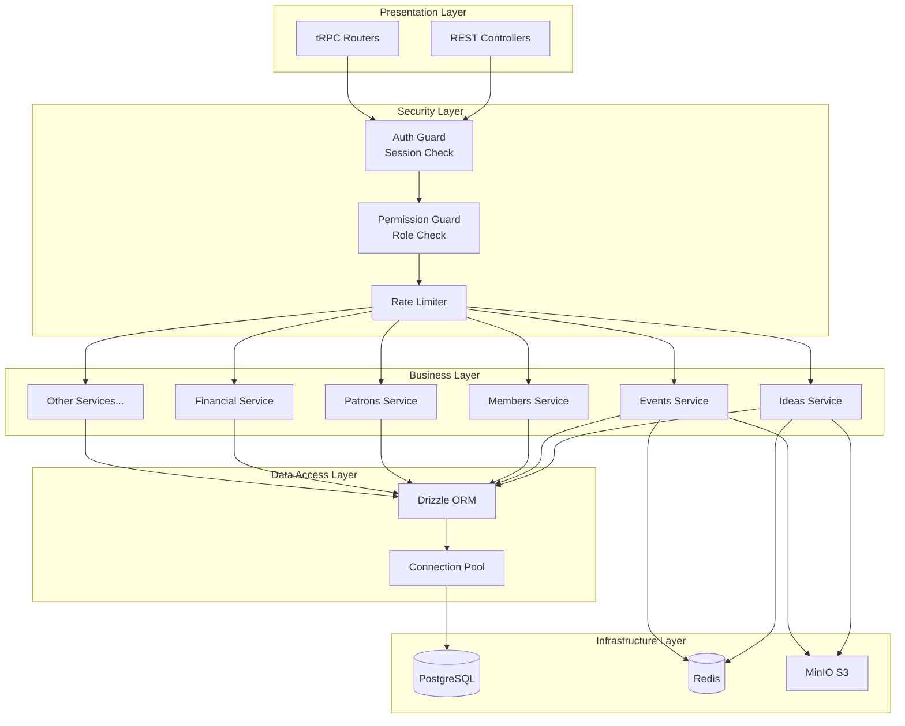
```mermaid
graph TB
    subgraph "Presentation Layer"
        REST[REST Controllers]
        tRPC[tRPC Routers]
    end

    subgraph "Security Layer"
        AuthGuard[Auth Guard<br/>Session Check]
        PermissionGuard[Permission Guard<br/>Role Check]
        RateLimit[Rate Limiter]
    end

    subgraph "Business Layer"
        IdeasService[Ideas Service]
        EventsService[Events Service]
        MembersService[Members Service]
        PatronsService[Patrons Service]
        FinancialService[Financial Service]
        OtherServices[Other Services...]
    end

    subgraph "Data Access Layer"
        DrizzleORM[Drizzle ORM]
        DatabasePool[Connection Pool]
    end

    subgraph "Infrastructure Layer"
        PostgreSQL[(PostgreSQL)]
        Redis[(Redis)]
        MinIO[MinIO S3]
    end

    REST --> AuthGuard
    tRPC --> AuthGuard

    AuthGuard --> PermissionGuard
    PermissionGuard --> RateLimit

    RateLimit --> IdeasService
    RateLimit --> EventsService
    RateLimit --> MembersService
    RateLimit --> PatronsService
    RateLimit --> FinancialService
    RateLimit --> OtherServices

    IdeasService --> DrizzleORM
    EventsService --> DrizzleORM
    MembersService --> DrizzleORM
    PatronsService --> DrizzleORM
    FinancialService --> DrizzleORM
    OtherServices --> DrizzleORM

    DrizzleORM --> DatabasePool
    DatabasePool --> PostgreSQL

    IdeasService --> Redis
    EventsService --> Redis

    IdeasService --> MinIO
    EventsService --> MinIO
```

---

## Flow d'Authentification

### OAuth2/OIDC avec Authentik

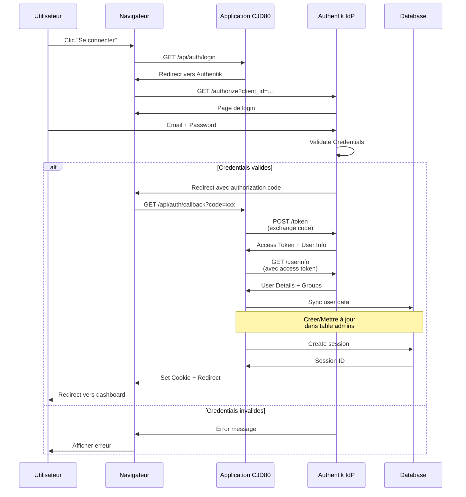
```mermaid
sequenceDiagram
    participant User as Utilisateur
    participant Browser as Navigateur
    participant App as Application CJD80
    participant Authentik as Authentik IdP
    participant DB as Database

    User->>Browser: Clic "Se connecter"
    Browser->>App: GET /api/auth/login
    App->>Browser: Redirect vers Authentik

    Browser->>Authentik: GET /authorize?client_id=...
    Authentik->>Browser: Page de login

    User->>Authentik: Email + Password
    Authentik->>Authentik: Validate Credentials

    alt Credentials valides
        Authentik->>Browser: Redirect avec authorization code
        Browser->>App: GET /api/auth/callback?code=xxx

        App->>Authentik: POST /token<br/>(exchange code)
        Authentik->>App: Access Token + User Info

        App->>Authentik: GET /userinfo<br/>(avec access token)
        Authentik->>App: User Details + Groups

        App->>DB: Sync user data
        Note over App,DB: Créer/Mettre à jour<br/>dans table admins

        App->>DB: Create session
        DB->>App: Session ID

        App->>Browser: Set Cookie + Redirect
        Browser->>User: Redirect vers dashboard
    else Credentials invalides
        Authentik->>Browser: Error message
        Browser->>User: Afficher erreur
    end
```

### Vérification de Session

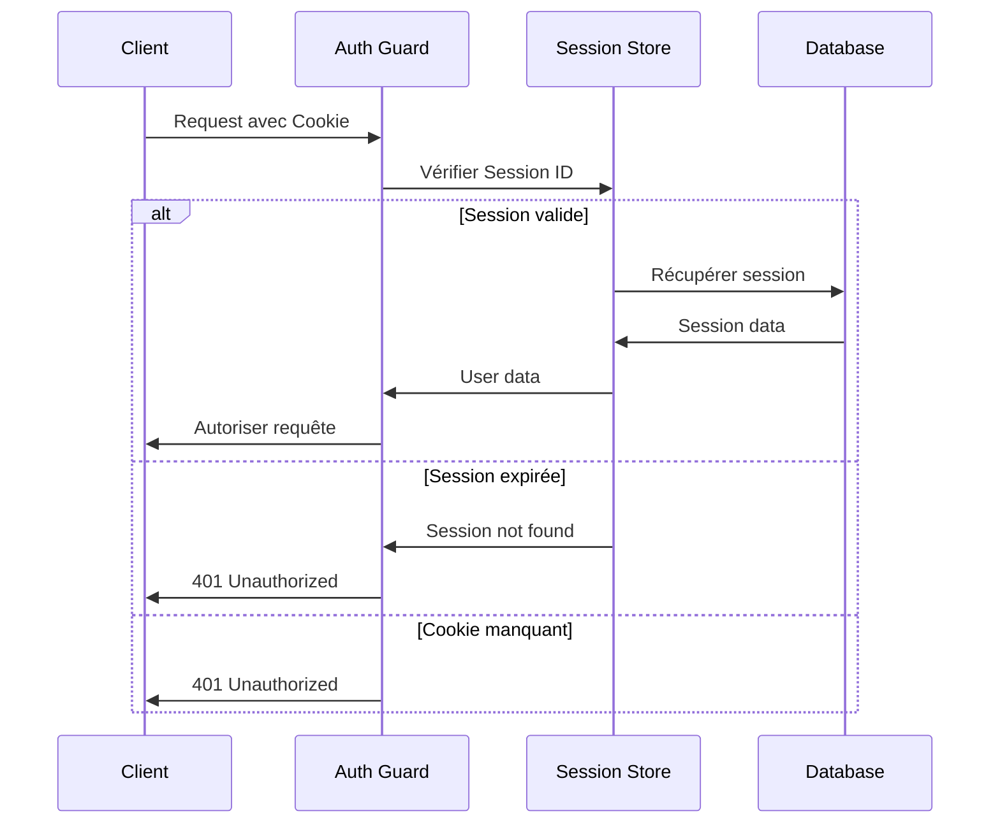
```mermaid
sequenceDiagram
    participant Client as Client
    participant Guard as Auth Guard
    participant Session as Session Store
    participant DB as Database

    Client->>Guard: Request avec Cookie
    Guard->>Session: Vérifier Session ID

    alt Session valide
        Session->>DB: Récupérer session
        DB->>Session: Session data
        Session->>Guard: User data
        Guard->>Client: Autoriser requête
    else Session expirée
        Session->>Guard: Session not found
        Guard->>Client: 401 Unauthorized
    else Cookie manquant
        Guard->>Client: 401 Unauthorized
    end
```

---

## Flow Requête-Réponse

### tRPC Query (Lecture)

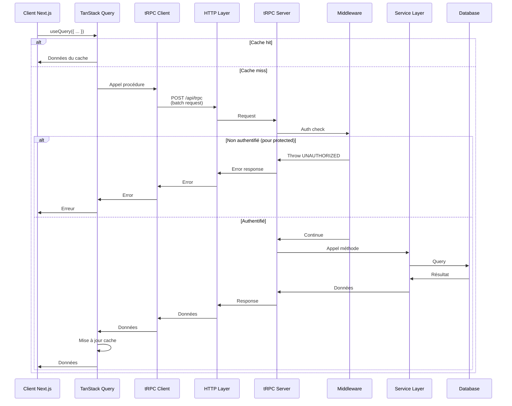
```mermaid
sequenceDiagram
    participant Client as Client Next.js
    participant TanStack as TanStack Query
    participant tRPCClient as tRPC Client
    participant HTTP as HTTP Layer
    participant tRPCServer as tRPC Server
    participant Middleware as Middleware
    participant Service as Service Layer
    participant DB as Database

    Client->>TanStack: useQuery({ ... })

    alt Cache hit
        TanStack->>Client: Données du cache
    else Cache miss
        TanStack->>tRPCClient: Appel procédure
        tRPCClient->>HTTP: POST /api/trpc<br/>(batch request)

        HTTP->>tRPCServer: Request
        tRPCServer->>Middleware: Auth check

        alt Non authentifié (pour protected)
            Middleware->>tRPCServer: Throw UNAUTHORIZED
            tRPCServer->>HTTP: Error response
            HTTP->>tRPCClient: Error
            tRPCClient->>TanStack: Error
            TanStack->>Client: Erreur
        else Authentifié
            Middleware->>tRPCServer: Continue
            tRPCServer->>Service: Appel méthode
            Service->>DB: Query
            DB->>Service: Résultat
            Service->>tRPCServer: Données
            tRPCServer->>HTTP: Response
            HTTP->>tRPCClient: Données
            tRPCClient->>TanStack: Données
            TanStack->>TanStack: Mise à jour cache
            TanStack->>Client: Données
        end
    end
```

### tRPC Mutation (Écriture)

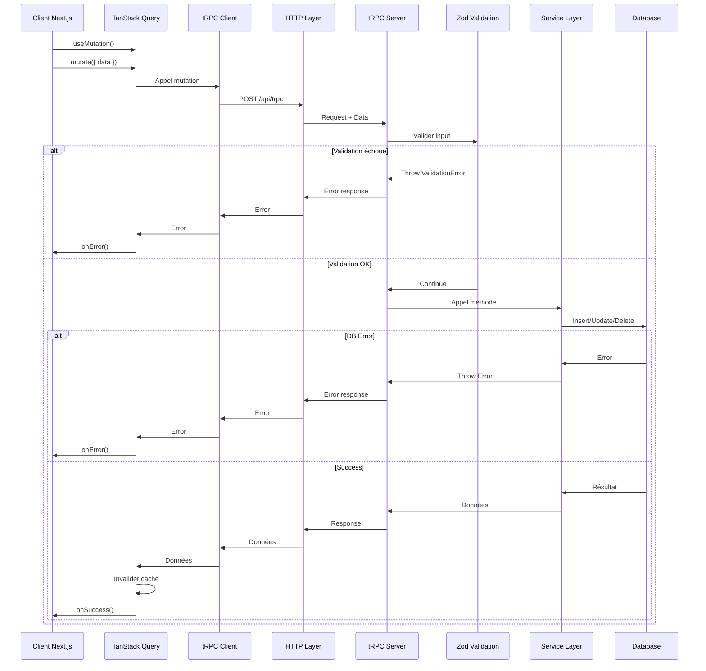
```mermaid
sequenceDiagram
    participant Client as Client Next.js
    participant TanStack as TanStack Query
    participant tRPCClient as tRPC Client
    participant HTTP as HTTP Layer
    participant tRPCServer as tRPC Server
    participant Validation as Zod Validation
    participant Service as Service Layer
    participant DB as Database

    Client->>TanStack: useMutation()
    Client->>TanStack: mutate({ data })

    TanStack->>tRPCClient: Appel mutation
    tRPCClient->>HTTP: POST /api/trpc

    HTTP->>tRPCServer: Request + Data
    tRPCServer->>Validation: Valider input

    alt Validation échoue
        Validation->>tRPCServer: Throw ValidationError
        tRPCServer->>HTTP: Error response
        HTTP->>tRPCClient: Error
        tRPCClient->>TanStack: Error
        TanStack->>Client: onError()
    else Validation OK
        Validation->>tRPCServer: Continue
        tRPCServer->>Service: Appel méthode
        Service->>DB: Insert/Update/Delete

        alt DB Error
            DB->>Service: Error
            Service->>tRPCServer: Throw Error
            tRPCServer->>HTTP: Error response
            HTTP->>tRPCClient: Error
            tRPCClient->>TanStack: Error
            TanStack->>Client: onError()
        else Success
            DB->>Service: Résultat
            Service->>tRPCServer: Données
            tRPCServer->>HTTP: Response
            HTTP->>tRPCClient: Données
            tRPCClient->>TanStack: Données
            TanStack->>TanStack: Invalider cache
            TanStack->>Client: onSuccess()
        end
    end
```

### REST API Request

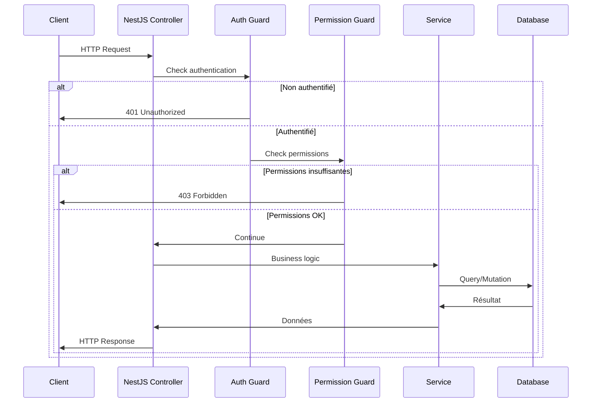
```mermaid
sequenceDiagram
    participant Client as Client
    participant Controller as NestJS Controller
    participant Guard as Auth Guard
    participant Permission as Permission Guard
    participant Service as Service
    participant DB as Database

    Client->>Controller: HTTP Request
    Controller->>Guard: Check authentication

    alt Non authentifié
        Guard->>Client: 401 Unauthorized
    else Authentifié
        Guard->>Permission: Check permissions

        alt Permissions insuffisantes
            Permission->>Client: 403 Forbidden
        else Permissions OK
            Permission->>Controller: Continue
            Controller->>Service: Business logic
            Service->>DB: Query/Mutation
            DB->>Service: Résultat
            Service->>Controller: Données
            Controller->>Client: HTTP Response
        end
    end
```

---

## Modèle de Données

### Relations Entre Entités

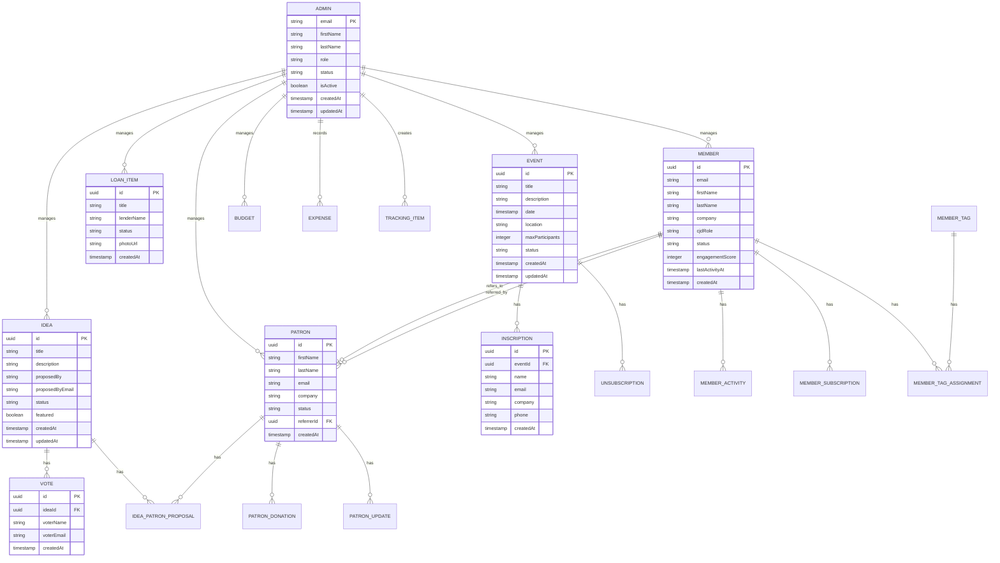
```mermaid
erDiagram
    ADMIN ||--o{ IDEA : manages
    ADMIN ||--o{ EVENT : manages
    ADMIN ||--o{ LOAN_ITEM : manages
    ADMIN ||--o{ MEMBER : manages
    ADMIN ||--o{ PATRON : manages
    ADMIN ||--o{ BUDGET : manages
    ADMIN ||--o{ EXPENSE : records
    ADMIN ||--o{ TRACKING_ITEM : creates

    IDEA ||--o{ VOTE : has
    IDEA ||--o{ IDEA_PATRON_PROPOSAL : has

    EVENT ||--o{ INSCRIPTION : has
    EVENT ||--o{ UNSUBSCRIPTION : has

    MEMBER ||--o{ MEMBER_ACTIVITY : has
    MEMBER ||--o{ MEMBER_SUBSCRIPTION : has
    MEMBER ||--o{ MEMBER_TAG_ASSIGNMENT : has
    MEMBER ||--o| PATRON : refers_to

    MEMBER_TAG ||--o{ MEMBER_TAG_ASSIGNMENT : has

    PATRON ||--o{ PATRON_DONATION : has
    PATRON ||--o{ PATRON_UPDATE : has
    PATRON ||--o{ IDEA_PATRON_PROPOSAL : has
    PATRON }o--|| MEMBER : referred_by

    ADMIN {
        string email PK
        string firstName
        string lastName
        string role
        string status
        boolean isActive
        timestamp createdAt
        timestamp updatedAt
    }

    IDEA {
        uuid id PK
        string title
        string description
        string proposedBy
        string proposedByEmail
        string status
        boolean featured
        timestamp createdAt
        timestamp updatedAt
    }

    VOTE {
        uuid id PK
        uuid ideaId FK
        string voterName
        string voterEmail
        timestamp createdAt
    }

    EVENT {
        uuid id PK
        string title
        string description
        timestamp date
        string location
        integer maxParticipants
        string status
        timestamp createdAt
        timestamp updatedAt
    }

    INSCRIPTION {
        uuid id PK
        uuid eventId FK
        string name
        string email
        string company
        string phone
        timestamp createdAt
    }

    MEMBER {
        uuid id PK
        string email
        string firstName
        string lastName
        string company
        string cjdRole
        string status
        integer engagementScore
        timestamp lastActivityAt
        timestamp createdAt
    }

    PATRON {
        uuid id PK
        string firstName
        string lastName
        string email
        string company
        string status
        uuid referrerId FK
        timestamp createdAt
    }

    LOAN_ITEM {
        uuid id PK
        string title
        string lenderName
        string status
        string photoUrl
        timestamp createdAt
    }
```

### Statuts et Workflows

```mermaid
stateDiagram-v2
    [*] --> Pending: Création

    state "Idée" {
        Pending --> UnderReview: Admin examine
        Pending --> Approved: Admin approuve
        Pending --> Rejected: Admin rejette

        UnderReview --> Approved: Validation
        UnderReview --> Rejected: Refus
        UnderReview --> Postponed: Report

        Approved --> Completed: Réalisée
        Approved --> Postponed: Report

        Postponed --> UnderReview: Reprise
        Postponed --> Rejected: Abandon
    }

    state "Événement" {
        Draft --> Published: Publier
        Published --> Cancelled: Annuler
        Published --> Postponed: Reporter
        Published --> Completed: Terminé

        Postponed --> Published: Reprogrammer
        Postponed --> Cancelled: Annuler

        Draft --> Cancelled: Supprimer
    }

    state "Matériel de prêt" {
        PendingLoan --> Available: Approuver
        PendingLoan --> Unavailable: Refuser

        Available --> Borrowed: Emprunter
        Available --> Unavailable: Retirer

        Borrowed --> Available: Retourner
        Borrowed --> Unavailable: Perdre
    }
```

---

## Flows Métier

### Création et Vote d'une Idée

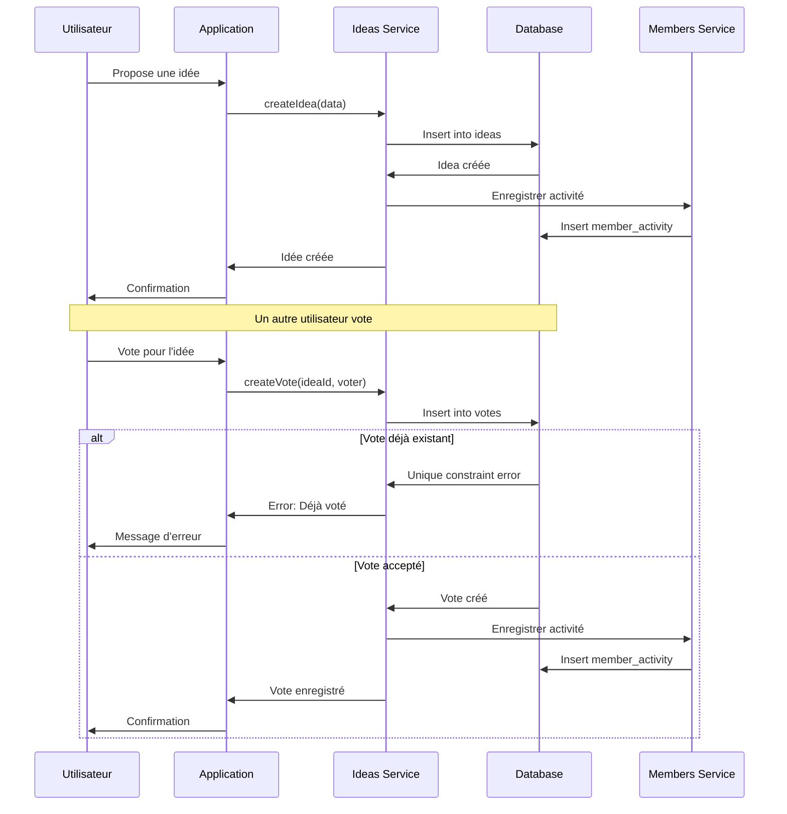
```mermaid
sequenceDiagram
    participant User as Utilisateur
    participant App as Application
    participant Service as Ideas Service
    participant DB as Database
    participant Member as Members Service

    User->>App: Propose une idée
    App->>Service: createIdea(data)
    Service->>DB: Insert into ideas
    DB->>Service: Idea créée
    Service->>Member: Enregistrer activité
    Member->>DB: Insert member_activity
    Service->>App: Idée créée
    App->>User: Confirmation

    Note over User,DB: Un autre utilisateur vote

    User->>App: Vote pour l'idée
    App->>Service: createVote(ideaId, voter)
    Service->>DB: Insert into votes

    alt Vote déjà existant
        DB->>Service: Unique constraint error
        Service->>App: Error: Déjà voté
        App->>User: Message d'erreur
    else Vote accepté
        DB->>Service: Vote créé
        Service->>Member: Enregistrer activité
        Member->>DB: Insert member_activity
        Service->>App: Vote enregistré
        App->>User: Confirmation
    end
```

### Inscription à un Événement

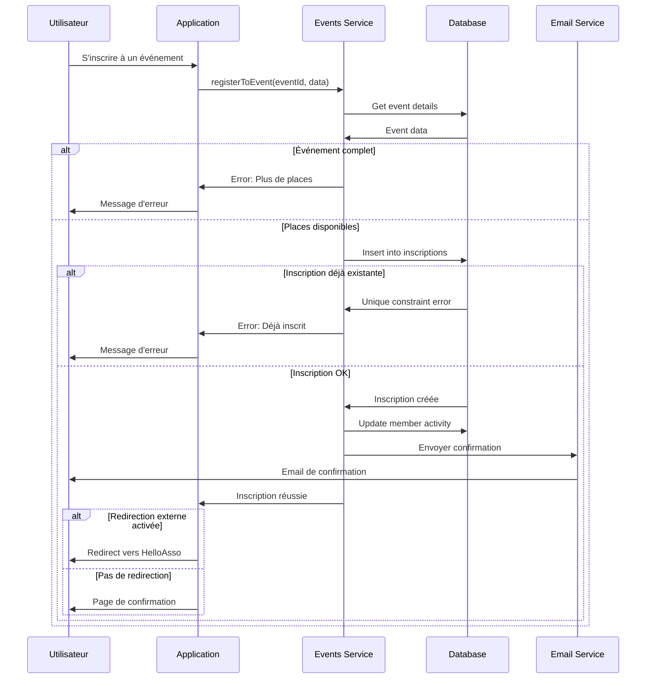
```mermaid
sequenceDiagram
    participant User as Utilisateur
    participant App as Application
    participant Service as Events Service
    participant DB as Database
    participant Email as Email Service

    User->>App: S'inscrire à un événement
    App->>Service: registerToEvent(eventId, data)

    Service->>DB: Get event details
    DB->>Service: Event data

    alt Événement complet
        Service->>App: Error: Plus de places
        App->>User: Message d'erreur
    else Places disponibles
        Service->>DB: Insert into inscriptions

        alt Inscription déjà existante
            DB->>Service: Unique constraint error
            Service->>App: Error: Déjà inscrit
            App->>User: Message d'erreur
        else Inscription OK
            DB->>Service: Inscription créée
            Service->>DB: Update member activity
            Service->>Email: Envoyer confirmation
            Email->>User: Email de confirmation
            Service->>App: Inscription réussie

            alt Redirection externe activée
                App->>User: Redirect vers HelloAsso
            else Pas de redirection
                App->>User: Page de confirmation
            end
        end
    end
```

### Gestion d'un Mécène

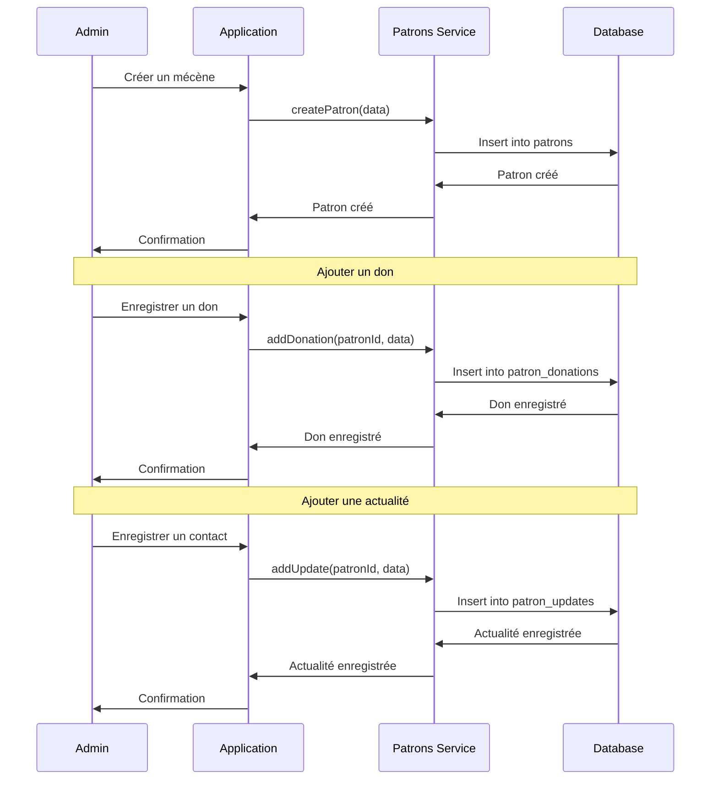
```mermaid
sequenceDiagram
    participant Admin as Admin
    participant App as Application
    participant Service as Patrons Service
    participant DB as Database

    Admin->>App: Créer un mécène
    App->>Service: createPatron(data)
    Service->>DB: Insert into patrons
    DB->>Service: Patron créé
    Service->>App: Patron créé
    App->>Admin: Confirmation

    Note over Admin,DB: Ajouter un don

    Admin->>App: Enregistrer un don
    App->>Service: addDonation(patronId, data)
    Service->>DB: Insert into patron_donations
    DB->>Service: Don enregistré
    Service->>App: Don enregistré
    App->>Admin: Confirmation

    Note over Admin,DB: Ajouter une actualité

    Admin->>App: Enregistrer un contact
    App->>Service: addUpdate(patronId, data)
    Service->>DB: Insert into patron_updates
    DB->>Service: Actualité enregistrée
    Service->>App: Actualité enregistrée
    App->>Admin: Confirmation
```

### Workflow Financier

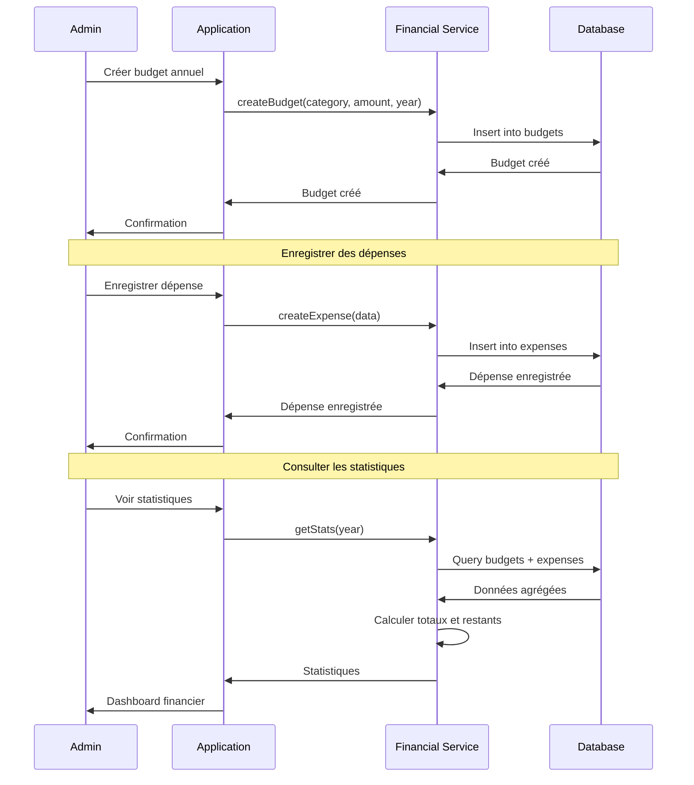
```mermaid
sequenceDiagram
    participant Admin as Admin
    participant App as Application
    participant Service as Financial Service
    participant DB as Database

    Admin->>App: Créer budget annuel
    App->>Service: createBudget(category, amount, year)
    Service->>DB: Insert into budgets
    DB->>Service: Budget créé
    Service->>App: Budget créé
    App->>Admin: Confirmation

    Note over Admin,DB: Enregistrer des dépenses

    Admin->>App: Enregistrer dépense
    App->>Service: createExpense(data)
    Service->>DB: Insert into expenses
    DB->>Service: Dépense enregistrée
    Service->>App: Dépense enregistrée
    App->>Admin: Confirmation

    Note over Admin,DB: Consulter les statistiques

    Admin->>App: Voir statistiques
    App->>Service: getStats(year)
    Service->>DB: Query budgets + expenses
    DB->>Service: Données agrégées
    Service->>Service: Calculer totaux et restants
    Service->>App: Statistiques
    App->>Admin: Dashboard financier
```

---

## Infrastructure

### Déploiement Docker

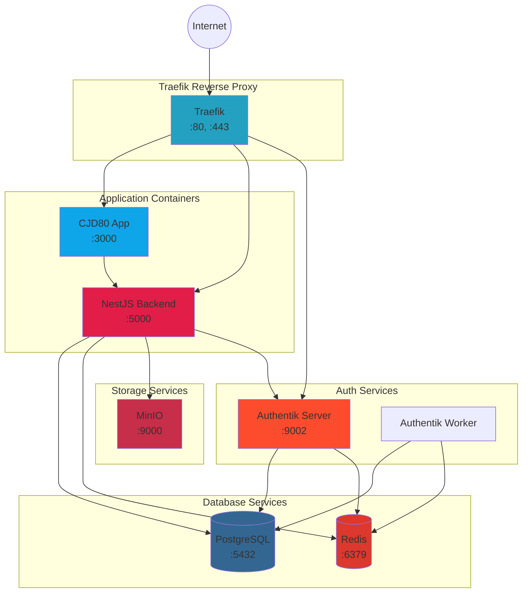
```mermaid
graph TB
    subgraph "Traefik Reverse Proxy"
        Traefik[Traefik<br/>:80, :443]
    end

    subgraph "Application Containers"
        App[CJD80 App<br/>:3000]
        Backend[NestJS Backend<br/>:5000]
    end

    subgraph "Database Services"
        PostgreSQL[(PostgreSQL<br/>:5432)]
        Redis[(Redis<br/>:6379)]
    end

    subgraph "Storage Services"
        MinIO[MinIO<br/>:9000]
    end

    subgraph "Auth Services"
        AuthentikServer[Authentik Server<br/>:9002]
        AuthentikWorker[Authentik Worker]
    end

    Internet((Internet)) --> Traefik
    Traefik --> App
    Traefik --> Backend
    Traefik --> AuthentikServer

    App --> Backend
    Backend --> PostgreSQL
    Backend --> Redis
    Backend --> MinIO
    Backend --> AuthentikServer

    AuthentikServer --> PostgreSQL
    AuthentikServer --> Redis
    AuthentikWorker --> PostgreSQL
    AuthentikWorker --> Redis

    style Traefik fill:#24a1c1
    style App fill:#0ea5e9
    style Backend fill:#e11d48
    style PostgreSQL fill:#336791
    style Redis fill:#dc382d
    style MinIO fill:#c72e49
    style AuthentikServer fill:#fd4b2d
```

### Réseaux Docker

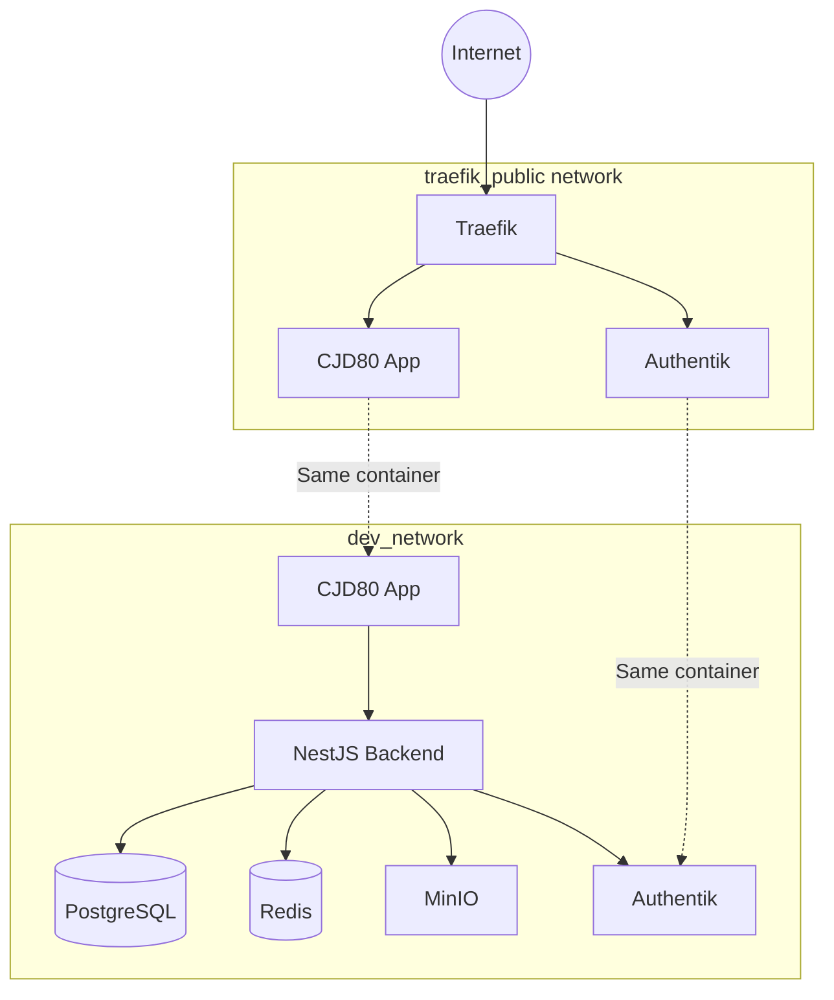
```mermaid
graph TB
    subgraph "traefik_public network"
        Traefik[Traefik]
        App[CJD80 App]
        Authentik[Authentik]
    end

    subgraph "dev_network"
        App2[CJD80 App]
        Backend[NestJS Backend]
        PostgreSQL[(PostgreSQL)]
        Redis[(Redis)]
        MinIO[MinIO]
        Authentik2[Authentik]
    end

    Internet((Internet)) --> Traefik
    Traefik --> App
    Traefik --> Authentik

    App2 --> Backend
    Backend --> PostgreSQL
    Backend --> Redis
    Backend --> MinIO
    Backend --> Authentik2

    App -.Same container.-> App2
    Authentik -.Same container.-> Authentik2
```

### Monitoring et Health Checks

```mermaid
graph TB
    HealthEndpoint[/api/health]

    HealthEndpoint --> AppHealth[Application Health]
    HealthEndpoint --> DBHealth[Database Health]
    HealthEndpoint --> RedisHealth[Redis Health]
    HealthEndpoint --> MinIOHealth[MinIO Health]

    AppHealth --> NestJS[NestJS Status]
    AppHealth --> tRPC[tRPC Status]

    DBHealth --> PostgreSQL[(PostgreSQL)]
    DBHealth --> ConnectionPool[Connection Pool]

    RedisHealth --> Redis[(Redis)]

    MinIOHealth --> MinIO[MinIO S3]

    PostgreSQL -.Metrics.-> Monitoring[Monitoring Dashboard]
    ConnectionPool -.Metrics.-> Monitoring
    Redis -.Metrics.-> Monitoring
    MinIO -.Metrics.-> Monitoring
    NestJS -.Logs.-> Winston[Winston Logger]

    style Monitoring fill:#fbbf24
    style Winston fill:#6366f1
```

---

## Résumé

Ce document contient tous les diagrammes Mermaid pour comprendre:

- **Architecture globale** - Vue d'ensemble du système
- **Architecture backend** - Modules NestJS et couches
- **Authentification** - Flow OAuth2/OIDC complet
- **Requête-Réponse** - tRPC et REST flows
- **Modèle de données** - Relations et statuts
- **Flows métier** - Processus utilisateur
- **Infrastructure** - Déploiement et monitoring

Ces diagrammes peuvent être copiés dans n'importe quel outil supportant Mermaid (GitHub, GitLab, VSCode, etc.).

---

**Dernière mise à jour**: 22 janvier 2026
**Version**: 2.0.0
